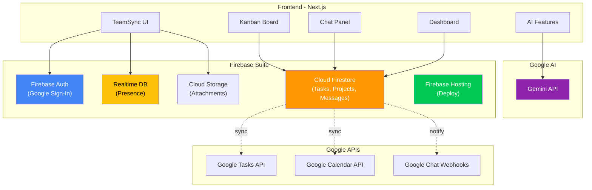

# Google Services That Can Power TeamSync

A mapping of every Google service/API that directly applies to our platform's features, with concrete integration details.

---

## Feature → Google Service Mapping

| Platform Feature | Google Service | What It Replaces / Enables |
|---|---|---|
| **Authentication & Login** | Firebase Authentication | Eliminates custom auth — Google Sign-In in minutes |
| **Real-time Database** | Cloud Firestore | Replaces localStorage — real-time sync across devices |
| **User Presence (Online/Offline)** | Firebase Realtime Database | Live "who's online" indicators |
| **File Storage** | Firebase Cloud Storage | Task attachments, profile avatars |
| **Hosting & Deployment** | Firebase Hosting | One-command deploy with CDN + SSL |
| **Team Chat / Messaging** | Firestore real-time listeners | Real-time project chat with `onSnapshot` |
| **Task Sync with Google** | Google Tasks API | 2-way sync tasks with user's Google Tasks |
| **Calendar Integration** | Google Calendar API | Due dates auto-create calendar events |
| **Team Notifications** | Google Chat API (Webhooks) | Push updates to Google Chat spaces |
| **AI-Powered Features** | Gemini API | Smart task summaries, auto-prioritization |
| **Analytics Backend** | Google Analytics / BigQuery | Usage analytics, team productivity metrics |

---

## 🔥 Tier 1: Firebase Suite (Highest Impact, Easiest Integration)

Firebase is the most impactful Google ecosystem to adopt. It replaces our entire backend layer and adds real-time capabilities that localStorage can't provide.

### 1. Firebase Authentication
**Feature:** User login & team identity

```
What it does:
├── Google Sign-In (one-tap login)
├── User profile (name, email, avatar — from Google account)
├── Session management (auto token refresh)
└── Security rules integration (who can access what)
```

**Impact:** Eliminates the need to build auth from scratch. Users log in with their Google account — instant team identity with real names and avatars.

**Effort:** ~30 minutes to integrate

---

### 2. Cloud Firestore (Real-time Database)
**Feature:** Task storage, project data, chat messages, activity logs

```
What it does:
├── Document-based NoSQL database
├── Real-time listeners (onSnapshot) — instant UI updates
├── Offline persistence — works without internet
├── Security rules — per-document access control
└── Scales automatically
```

**Impact:** This is the **single biggest upgrade**. Instead of localStorage (single device, no sharing), Firestore enables:
- **Multi-user real-time collaboration** — everyone sees task changes instantly
- **Persistent data** — survives browser clears, accessible from any device
- **Offline mode** — edit tasks on a plane, syncs when back online

**Data Model Example:**
```
firestore/
├── projects/{projectId}
│   ├── name, description, createdBy, members[]
│   ├── columns/{columnId}
│   │   └── name, order
│   └── tasks/{taskId}
│       └── title, description, status, assignee, priority, dueDate
├── messages/{projectId}/chat/{messageId}
│   └── text, sender, timestamp
├── activity/{projectId}/log/{activityId}
│   └── action, actor, target, timestamp
└── users/{userId}
    └── displayName, email, photoURL, online
```

**Effort:** ~2-3 hours to replace localStorage layer

---

### 3. Firebase Realtime Database (Presence System)
**Feature:** Online/offline status indicators

```
What it does:
├── onDisconnect() hooks — auto-update status when user leaves
├── Millisecond latency for ephemeral state
└── Perfect for "typing..." indicators
```

**Impact:** Enables live presence indicators on team member cards — see who's online in real-time.

> [!TIP]
> Use **Firestore** for durable data (tasks, messages) and **Realtime Database** specifically for ephemeral presence/typing indicators. This is the recommended Google pattern.

**Effort:** ~1 hour

---

### 4. Firebase Cloud Storage
**Feature:** File attachments on tasks

```
What it does:
├── Upload files (docs, images, screenshots)
├── Secure download URLs
├── Integrates with Firebase Auth (security rules)
└── 5GB free tier
```

**Impact:** Team members can attach screenshots, documents, or designs directly to task cards.

**Effort:** ~1 hour

---

### 5. Firebase Hosting
**Feature:** Deployment & hosting

```
What it does:
├── One-command deploy: `firebase deploy`
├── Global CDN
├── Free SSL certificate
├── Preview channels for PRs
└── Free tier: 10GB storage, 360MB/day transfer
```

**Impact:** Zero-config deployment. `firebase deploy` and you're live with a `.web.app` domain.

**Effort:** ~15 minutes

---

## 🔗 Tier 2: Google Workspace APIs (Value-Add Integrations)

These APIs connect TeamSync with tools teams already use daily.

### 6. Google Tasks API
**Feature:** Sync tasks bidirectionally with Google Tasks

```
What it does:
├── Create tasks in user's Google Tasks from TeamSync
├── Mark complete in either app → syncs both
├── Tasks appear in Gmail sidebar
└── Requires OAuth consent
```

**Impact:** Tasks created in TeamSync show up in the user's Google Tasks/Gmail — no context switching.

**Effort:** ~3 hours (requires OAuth setup)

---

### 7. Google Calendar API
**Feature:** Due dates → Calendar events

```
What it does:
├── Auto-create calendar events for tasks with due dates
├── Set reminders (email, push notification)
├── Show team availability
└── Requires OAuth consent
```

**Impact:** When a task has a due date, it automatically appears on the assignee's Google Calendar with a reminder. Teams never miss deadlines.

**Effort:** ~3 hours

---

### 8. Google Chat API (Incoming Webhooks)
**Feature:** Push notifications to Google Chat spaces

```
What it does:
├── Send formatted cards to a Google Chat space
├── "🔴 Alice moved 'Fix auth bug' to CRITICAL"
├── Webhook-based (no OAuth needed for basic use)
└── Supports interactive cards with buttons
```

**Impact:** Teams using Google Chat get real-time project notifications in their existing chat tool — without leaving Chat.

**Effort:** ~2 hours

---

## 🤖 Tier 3: AI with Gemini API (Differentiator)

### 9. Gemini API
**Feature:** AI-powered task intelligence

```
Possible capabilities:
├── Auto-summarize project status ("3 tasks blocked, 2 overdue")
├── Smart task descriptions from brief titles
├── Auto-suggest priority based on description keywords
├── Generate daily standup summaries from activity feed
├── Natural language task creation: "Add a high-priority bug fix for auth"
└── Workload balancing suggestions
```

**Impact:** This is the **wow factor** differentiator. AI-generated standup summaries alone would save teams 15+ minutes per day.

**Effort:** ~4-5 hours for core features

---

## 📊 Recommended Integration Strategy

For a hackathon or MVP, I recommend integrating in this priority order:

### Must-Have (Core Platform)
| # | Service | Why |
|---|---|---|
| 1 | **Firebase Auth** | Instant Google Sign-In, team identity, avatars |
| 2 | **Cloud Firestore** | Real-time multi-user collaboration — the killer feature |
| 3 | **Firebase Hosting** | One-command deployment |

### Should-Have (Strong Differentiators)
| # | Service | Why |
|---|---|---|
| 4 | **Realtime Database** | Presence indicators (who's online) |
| 5 | **Gemini API** | AI standup summaries, smart descriptions |
| 6 | **Cloud Storage** | File attachments on tasks |

### Nice-to-Have (Polish)
| # | Service | Why |
|---|---|---|
| 7 | **Google Calendar API** | Due date → calendar event sync |
| 8 | **Google Tasks API** | 2-way sync with Google Tasks |
| 9 | **Google Chat Webhooks** | Notifications in Google Chat |

---

## 💰 Cost Considerations (Free Tier)

All of these services have generous free tiers that are more than sufficient for a hackathon or small team:

| Service | Free Tier |
|---|---|
| Firebase Auth | Unlimited users |
| Firestore | 1 GB storage, 50K reads/day, 20K writes/day |
| Realtime Database | 1 GB storage, 10 GB/month transfer |
| Cloud Storage | 5 GB storage |
| Firebase Hosting | 10 GB storage, 360 MB/day transfer |
| Gemini API | Free tier with rate limits (sufficient for MVP) |
| Google Tasks/Calendar API | Free with OAuth |
| Google Chat Webhooks | Free |

> [!NOTE]
> **Total cost for MVP: $0.** All services fall within free tiers for small-to-medium team usage.

---

## Updated Architecture Diagram


